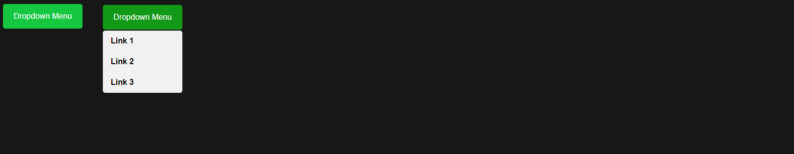

# Dropdown Menu Tutorial

This project is a step-by-step tutorial on how to create a dropdown menu that 
expands and collapses upon clicking, using `HTML`, `CSS`, and `JavaScript`.



## Project Demo

You can see the live demo of the project [here](https://douglasfssantiago.github.io/dropdown-menu-tutorial/).

## Table of Contents

- [Introduction](#introduction)
- [Requirements](#requirements)
- [Usage](#usage)
- [Step-by-Step Guide](#step-by-step-guide)
  - [Step 1: HTML Structure](#step-1-html-structure)
  - [Step 2: CSS Styling](#step-2-css-styling)
  - [Step 3: JavaScript Logic](#step-3-javascript-logic)
- [Contributing](#contributing)

## Introduction

This tutorial will guide you through the process of creating a simple dropdown 
menu. The dropdown menu will expand when the button is clicked and collapse 
when clicking outside the menu or clicking the button again.

## Requirements

To follow this tutorial, you'll need:
- Basic knowledge of HTML, CSS, and JavaScript.
- A code editor like Visual Studio Code.
- A web browser to test your application.

## Usage

Clone the repository and open the `index.html` file in your web browser to see 
the dropdown menu in action.

```sh
git clone https://github.com/douglasfssantiago/dropdown-menu-tutorial.git
cd dropdown-menu-tutorial
```
## Step-by-Step Guide

#### Step 1: HTML Structure
- Create an index.html file with the necessary elements for the dropdown menu.

#### Step 2: CSS Styling
- CSS Styling: Define styles in styles.css to format the dropdown menu and its elements.

#### Step 3: JavaScript Logic
- JavaScript Logic: Implement script.js to handle the click events and toggle the dropdown visibility.

## Contributing
- Created by Douglas F. S. Santiago
